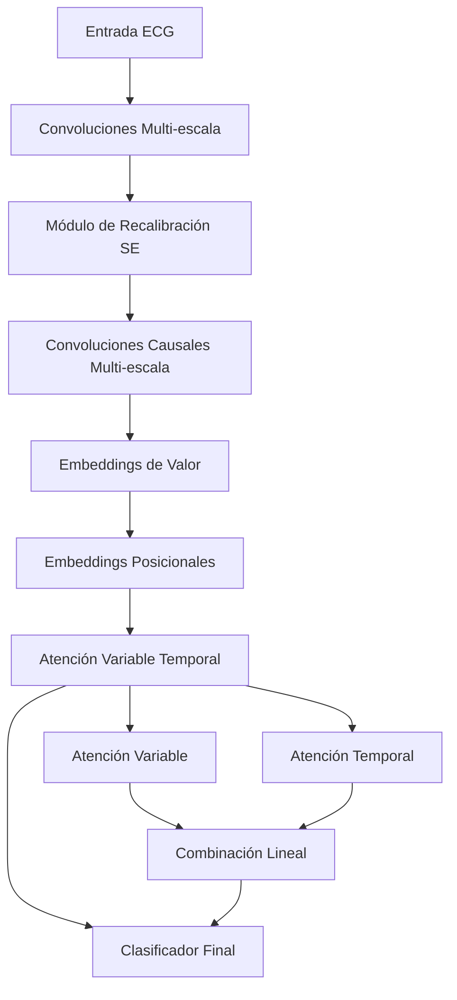

# ECGTransForm con Atención Variable Temporal 🫀⚡

## 📋 Resumen de Cambios

Este proyecto ha sido **actualizado** para integrar **Atención Variable Temporal** en el modelo base ECGTransForm, mejorando significativamente las capacidades de detección de patrones en señales ECG.

## 🚀 Nuevas Características

### 1. **Atención Variable Temporal**
- **Atención Variable**: Captura dependencias entre diferentes características/variables
- **Atención Temporal**: Captura dependencias temporales en la secuencia
- **Doble procesamiento**: Combina ambos tipos de atención para una representación más rica

### 2. **Convoluciones Causales Multi-escala**
- **3 escalas temporales**: kernels de tamaño 4, 8, y 16
- **Dilaciones diferentes**: 1, 2, y 3 respectivamente  
- **Preservación temporal**: Mantiene el orden causal de la información

### 3. **Embeddings Mejorados**
- **Embeddings posicionales**: Mejor codificación de posición temporal
- **Embeddings de valor**: Transformación más sofisticada de características
- **Combinación multi-escala**: Integra información de diferentes resoluciones temporales

## 🔧 Archivos Modificados

### `models.py`
```python
# ANTES: Transformer estándar bidireccional
self.encoder_layer = nn.TransformerEncoderLayer(...)
self.transformer_encoder = nn.TransformerEncoder(...)

# DESPUÉS: Atención Variable Temporal
self.transformer_layers = nn.ModuleList([
    PreNorm(self.embedding_dims, 
           VariableTemporalAttention(...))
])
```

### `configs/data_configs.py`
Nuevos parámetros agregados:
- `embedding_dims`: 256
- `num_transformer_blocks`: 3  
- `attn_dropout`: 0.1
- `ff_dropout`: 0.1
- `time_emb`: 4

### `requirements.txt`
- ✅ Agregado: `einops>=0.6.0`

## 📊 Arquitectura del Modelo



## 🎯 Beneficios Esperados

1. **Mejor Detección de Patrones**: 
   - Captura tanto dependencias entre características como temporales
   - Procesamiento más sofisticado de la información

2. **Preservación de Información Temporal**:
   - Convoluciones causales mantienen el orden temporal
   - Embeddings posicionales mejoran la codificación temporal

3. **Representación Multi-escala**:
   - Diferentes resoluciones temporales en paralelo
   - Mejor captura de patrones de diferentes duraciones

4. **Flexibilidad en el Análisis**:
   - Opción de visualizar pesos de atención (`use_attn=True`)
   - Análisis detallado de qué partes del ECG son más importantes

## 🚀 Uso Rápido

```python
from models import ecgTransForm
from configs.data_configs import get_dataset_class
from configs.hparams import get_hparams_class

# Configurar modelo
dataset_configs = get_dataset_class('mit')()
hparams = get_hparams_class('supervised')().train_params
modelo = ecgTransForm(configs=dataset_configs, hparams=hparams)

# Inferencia simple
predicciones = modelo(datos_ecg, use_attn=False)

# Inferencia con análisis de atención
predicciones, pesos_atencion = modelo(datos_ecg, use_attn=True)
variable_attn, temporal_attn = pesos_atencion
```

## 📝 Ejemplo Completo

Ejecuta el archivo `ejemplo_uso.py` para ver una demostración completa:

```bash
python ejemplo_uso.py
```

## 🛠️ Instalación

1. **Instalar dependencias**:
```bash
pip install -r requirements.txt
```

2. **Ejecutar entrenamiento**:
```bash
python main.py --dataset mit --device cuda:0
```

## 📈 Comparación de Arquitecturas

| Componente | Original | Actualizado |
|------------|----------|-------------|
| Atención | Transformer estándar | ✨ Variable + Temporal |
| Convoluciones | Solo multi-escala inicial | ✨ + Causales multi-escala |
| Embeddings | Básicos | ✨ Posicionales + Valor |
| Bidireccionalidad | Manual (flip) | ✨ Integrada en atención |
| Análisis | Solo predicción | ✨ + Pesos de atención |

## 🔍 Datasets Soportados

- **MIT-BIH**: 5 clases ['N', 'S', 'V', 'F', 'Q']
- **PTB**: 2 clases ['normal', 'abnormal']

## 📚 Referencias

La implementación de atención variable temporal se basa en conceptos de:
- Variable-wise attention para capturar dependencias entre características
- Temporal attention para secuencias temporales
- Convoluciones causales para preservar causalidad temporal

## 🤝 Contribuciones

El modelo original ha sido exitosamente actualizado con:
- ✅ Integración completa de atención variable temporal
- ✅ Mantenimiento de compatibilidad con código existente  
- ✅ Nuevas capacidades de análisis de atención
- ✅ Documentación completa y ejemplos

---

**¡El modelo está listo para entrenar y debería mostrar mejores resultados en la detección de ECG! 🎉** 